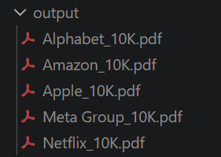
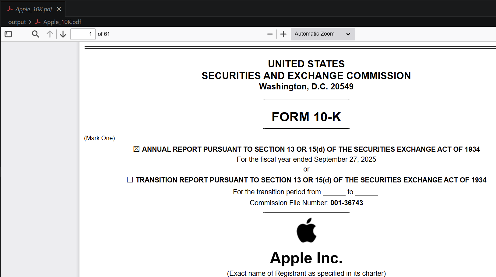

# About SEC 10-K Fetcher

SEC 10-K Fetcher is a Python automation tool to download the latest 10-K filings from the U.S. Securities and Exchange Commission (SEC) EDGAR database for multiple companies. It uses **Playwright** to render filings and save them as PDFs.

This project uses the official SEC EDGAR APIs:

* Submissions API:
  <https://data.sec.gov/submissions/CIK##########.json>

The CIK (Central Index Key) is required to query company filings.

## Features

* Modular architecture
* SEC API integration
* Configurable companies list
* Logger (console)
* Automated PDF generation

## Design Decisions

* Company CIKs are hardcoded to keep the implementation simple and focused on the core task.
* CIKs were resolved using the SEC lookup service:
  <https://www.sec.gov/search-filings/cik-lookup>
* Playwright was chosen for accurate rendering, at the cost of heavier dependencies.

## Installation and Run

1.Clone the repository:

```bash
git clone https://github.com/<parganarzu>/sec_10k_fetcher.git
cd sec_10k_fetcher
```

2.Create a Python virtual environment:

```bash
python -m venv venv
source venv/bin/activate   # Linux/Mac
venv\Scripts\Activate.ps1  # Windows
```

3.Install dependencies:

```bash
pip install -r requirements.txt
playwright install
```

3.Run the app:

```bash
python -m app.main
```

4.Run the unit tests

```bash
pytest -v tests
```

## Expected Output

vscode-pdf extension can be used for displaying pdfs.




